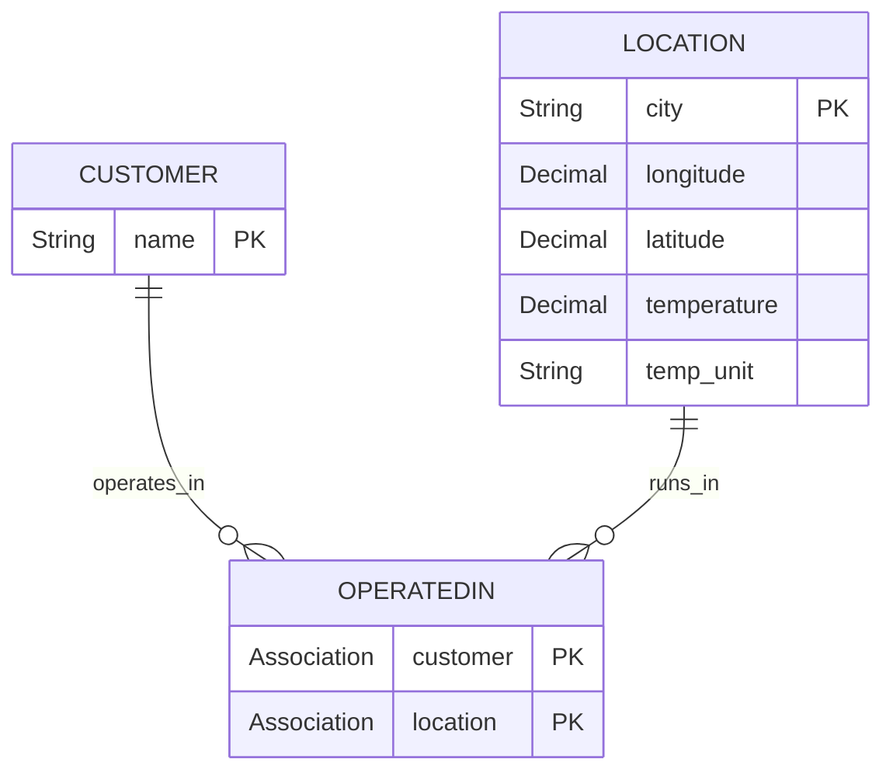

# 🌦️ 01 – Initial Setup

This branch represents the starting point of the **Consuming External Services – Weather** live session.

In this step, we set up the basic SAP CAP project structure, define the domain model in CDS, and prepare the service definition.

⚠️ In this branch, we focus purely on **modeling and service definition**.  
The application is **not executed yet** (runtime, sample data, and external API integration come in later branches).

---

## 🎯 Objectives of This Step

- Initialize the CAP project structure
- Define the core domain model in `db/schema.cds`
- Create the service definition in `srv/service.cds`
- Establish a clean baseline for the upcoming steps (REST consumption, sample data, actions)

---

## 🗂 Project Structure

```
.
├── db/
│   └── schema.cds
├── srv/
│   └── service.cds
├── package.json
└── ...
```

- `db/` contains the **domain model**
- `srv/` contains the **service definition** (OData exposure)

---

## 🧩 Domain Model (ER Model)

The initial data model defines three core concepts:

- **Customer**: a customer entity
- **Location**: a city/location with coordinates and (later) weather-related attributes
- **OperatedIn**: a link entity that connects customers to locations (many-to-many relationship)



Notes:

- `OperatedIn` acts as a **join entity** between `Customer` and `Location`.
- `coordinates` is modeled as a structured type in CDS; in the ER diagram it is represented as `longitude` and `latitude`.

---

## 🌐 Service Definition

The model is prepared to be exposed via an OData V4 service through `srv/service.cds`.

At this step, we only define the service contract (projections / exposure).  
Execution, testing, and service handlers are introduced in later branches.

---

## 🧠 What You Achieved in This Branch

- A clean CAP baseline with `db/` and `srv/`
- A weather-related domain model with relationships
- A prepared OData service definition (no runtime yet)